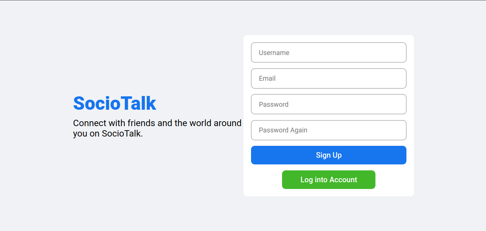
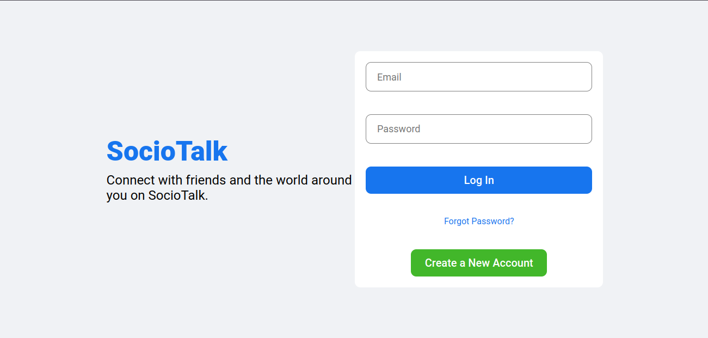
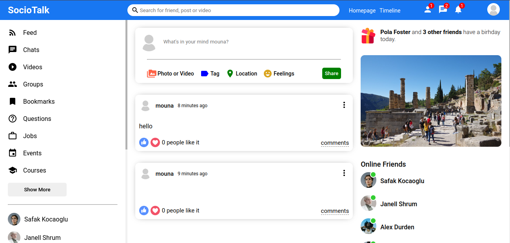
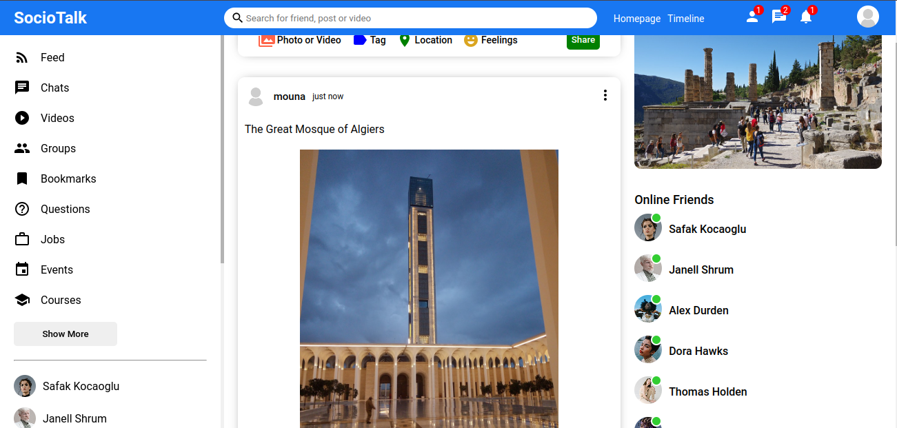
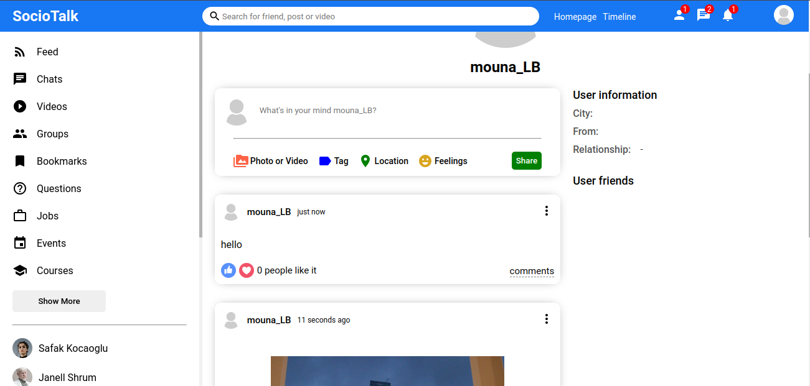

# SocioTalk
SocioTalk brings together the vibrancy of social networking with the immediacy of instant messaging, creating a comprehensive platform where users can engage, share, and connect in real-time. This platform blends the depth of social interactions with the spontaneity of live chats, making it easy for users to express themselves, stay informed, and keep in touch with friends and family.

# Core Features
- Interactive Social Feeds: Post thoughts, share life updates, and engage with content from your network. React, comment, and dive deep into discussions that matter.
- Real-Time Messaging: Seamlessly switch between commenting on a friend's post to a private conversation or a group chat to plan your next meetup.
- Rich Media Sharing: Whether it's a photo, a video, or a document, sharing media is intuitive and instant, both in posts and messages.
- Friend Connections: Manage your social connections with ease. Send friend requests, accept them, or unfollow with just a click.
- Personalized User Profiles: Customize your profile to reflect your personality. Showcase your interests with profile pictures, cover photos, and personal bios.
- Instant Notifications: Stay on top of the things you care about with instant alerts for interactions and messages.
- Privacy and Security: Built with your privacy and security in mind, ensuring that your conversations and personal data are protected with end-to-end encryption.
# Technology Stack
SocioTalk is crafted using cutting-edge technologies ensuring a responsive, robust, and scalable service:

- Backend: Powered by Node.js and Express, delivering fast, scalable, and efficient server responses.
- Database: Utilizes MongoDB for flexible data storage and high-performance queries.
- Frontend: Built with React.js for a smooth, component-driven user experience.
- Real-Time Interactions: Socket.IO facilitates live communication, ensuring messages and notifications are delivered without delay.
- Security: Comprehensive security strategies are implemented to safeguard user data and privacy.

---

---

---

---

